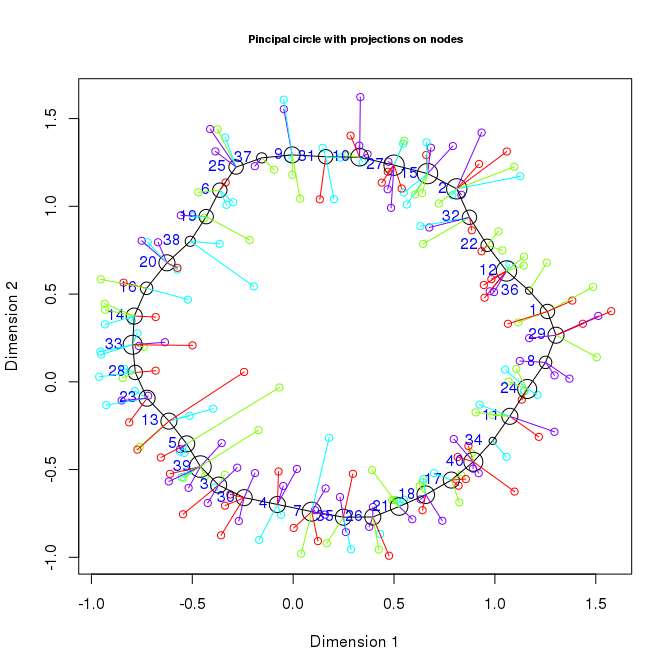
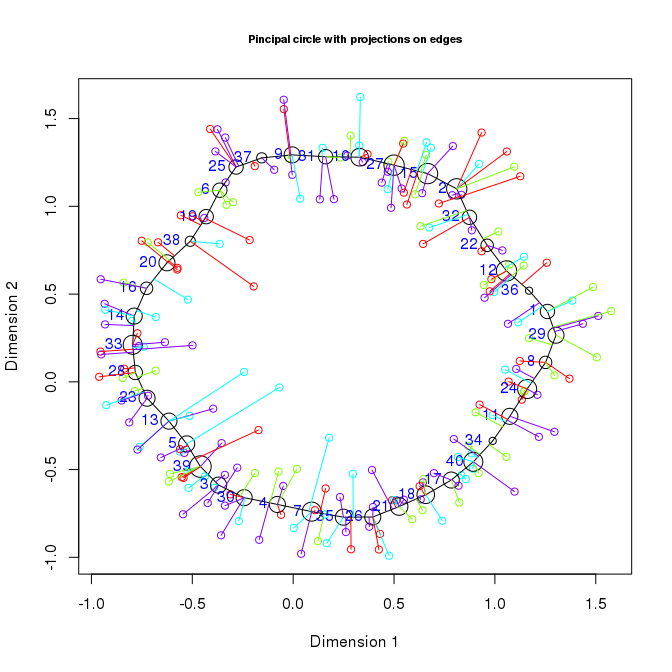
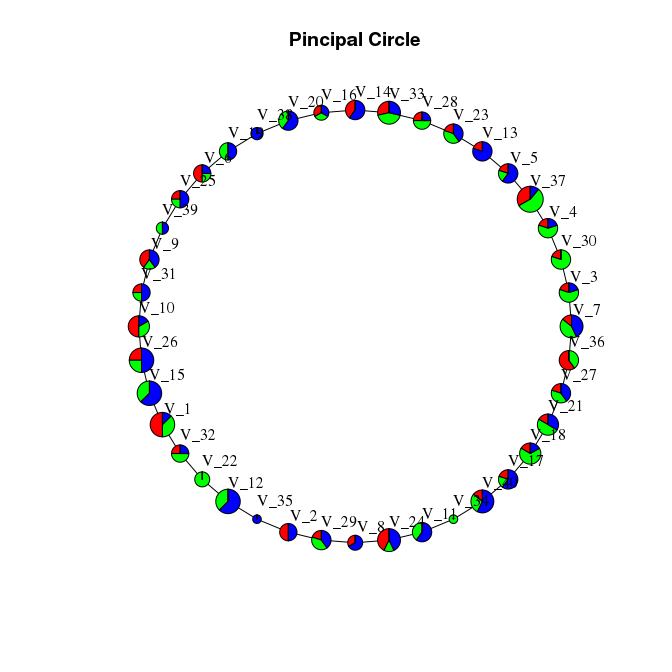

This document describes how to produce a circular principal graph. Note that some plots are not visibl. This is due to Github not liking large html files.

Building a principal circle
---------------------------

The `simple_circle` dataset included in the package describe points placed on a three dimensional circle and We can use it to test the usage of principal cicrles

``` r
library(rpgraph)
```

    ## Loading required package: rJava

    ## 
    ## Attaching package: 'rpgraph'

    ## The following object is masked from 'package:base':
    ## 
    ##     Filter

``` r
Data <- simple_circle
Results <- computeElasticPrincipalGraph(Data = Data, NumNodes = 40, Method = 'CircleConfiguration')
```

    ## Configuring engine ......[1] "Empty initialization"
    ## [1] ""
    ## [1] "Running engine"

Now `Results` will be a list and the first element will contain the processed principal graph. Diagnostic information can be obtained using

``` r
plotMSDEnergyPlot(Results[[1]], Main = "Pincipal Circle", Cex.Main = 1)
```


and

``` r
accuracyComplexityPlot(Results[[1]], Main = "Pincipal Circle", Cex.Main = 1, Mode = 5)
```


It it also possible to zoom into a specific area of the accuracy/complexity plot by using the Xlims parameter.

``` r
accuracyComplexityPlot(Results[[1]], Main = "Pincipal Circle", Cex.Main = 1, Xlims = c(.97, .98))
```


Data can be plotted in 2D using the R built-in functions

``` r
plotData2D(Data = simple_circle, PrintGraph = Results[[1]],
           GroupsLab = rep(1, nrow(simple_circle)), Xlab = "Dimension 1", Ylab = "Dimension 2")
```


or plotly, which produces an interactive plot. Using plotly interactivelly requires running the code in RStudio (does it?)

``` r
plotData2D(Data = simple_circle, PrintGraph = Results[[1]], Plot.ly = TRUE,
           GroupsLab = factor(rep(1, nrow(simple_circle))), Xlab = "Dimension 1", Ylab = "Dimension 2")
```

This commands will produce a list of warnings, which can be ignored. Unfortunately there is not an easy way to fix it at this time.

The plotly graph can be exported on the web, for example on [plot.ly](http://plot.ly) using the instruction provided [here](http://plot.ly/r/getting-started/).

It is also possible to have the point ptojections plotted by specifying the correct value for the `PlotProjections` argument. For example it is possible to visualize projections on the nodes by setting `PlotProjections = "onNodes"`

``` r
plotData2D(Data = simple_circle, PrintGraph = Results[[1]], PlotProjections = "onNodes",
           GroupsLab = rep(1, nrow(simple_circle)), Xlab = "Dimension 1", Ylab = "Dimension 2")
```



    ## [1] "TaxonList will be computed. Consider do that separetedly"

and to visualize the projections on edges by typing `PlotProjections = "onEdges"`

``` r
plotData2D(Data = simple_circle, PrintGraph = Results[[1]], PlotProjections = "onEdges",
           GroupsLab = rep(1, nrow(simple_circle)), Xlab = "Dimension 1", Ylab = "Dimension 2")
```



    ## [1] "Edge Projections will be computed. Consider do that separetedly"
    ## [1] "TaxonList will be computed. Consider doing that separetedly"
    ## [1] "Updating projection of point 96"
    ## [1] "Updating projection of point 101"
    ## [1] "Updating projection of point 142"
    ## [1] "Updating projection of point 100"
    ## [1] "Updating projection of point 133"
    ## [1] "Updating projection of point 192"
    ## [1] "Updating projection of point 196"
    ## [1] "Updating projection of point 79"
    ## [1] "Updating projection of point 113"
    ## [1] "Updating projection of point 161"
    ## [1] "Updating projection of point 22"
    ## [1] "Updating projection of point 23"
    ## [1] "Updating projection of point 25"
    ## [1] "Updating projection of point 149"
    ## [1] "Updating projection of point 188"
    ## [1] "Updating projection of point 190"
    ## [1] "Updating projection of point 191"
    ## [1] "Updating projection of point 43"
    ## [1] "Updating projection of point 118"
    ## [1] "Updating projection of point 27"
    ## [1] "Updating projection of point 70"
    ## [1] "Updating projection of point 147"
    ## [1] "Updating projection of point 176"
    ## [1] "Updating projection of point 180"
    ## [1] "Updating projection of point 200"
    ## [1] "Updating projection of point 34"
    ## [1] "Updating projection of point 36"
    ## [1] "Updating projection of point 69"
    ## [1] "Updating projection of point 73"
    ## [1] "Updating projection of point 114"
    ## [1] "Updating projection of point 140"
    ## [1] "Updating projection of point 153"
    ## [1] "Updating projection of point 42"
    ## [1] "Updating projection of point 57"
    ## [1] "Updating projection of point 154"
    ## [1] "Updating projection of point 159"
    ## [1] "Updating projection of point 48"
    ## [1] "Updating projection of point 105"
    ## [1] "Updating projection of point 139"
    ## [1] "Updating projection of point 146"
    ## [1] "Updating projection of point 187"
    ## [1] "Updating projection of point 72"
    ## [1] "Updating projection of point 88"
    ## [1] "Updating projection of point 98"
    ## [1] "Updating projection of point 106"
    ## [1] "Updating projection of point 169"
    ## [1] "Updating projection of point 175"
    ## [1] "Updating projection of point 199"
    ## [1] "Updating projection of point 60"
    ## [1] "Updating projection of point 103"
    ## [1] "Updating projection of point 129"
    ## [1] "Updating projection of point 173"
    ## [1] "Updating projection of point 17"
    ## [1] "Updating projection of point 104"
    ## [1] "Updating projection of point 130"
    ## [1] "Updating projection of point 143"
    ## [1] "Updating projection of point 193"
    ## [1] "Updating projection of point 16"
    ## [1] "Updating projection of point 85"
    ## [1] "Updating projection of point 157"
    ## [1] "Updating projection of point 78"
    ## [1] "Updating projection of point 81"
    ## [1] "Updating projection of point 97"
    ## [1] "Updating projection of point 151"
    ## [1] "Updating projection of point 178"
    ## [1] "Updating projection of point 3"
    ## [1] "Updating projection of point 29"
    ## [1] "Updating projection of point 30"
    ## [1] "Updating projection of point 83"
    ## [1] "Updating projection of point 128"
    ## [1] "Updating projection of point 177"
    ## [1] "Updating projection of point 182"
    ## [1] "Updating projection of point 185"
    ## [1] "Updating projection of point 13"
    ## [1] "Updating projection of point 87"
    ## [1] "Updating projection of point 120"
    ## [1] "Updating projection of point 179"
    ## [1] "Updating projection of point 86"
    ## [1] "Updating projection of point 165"
    ## [1] "Updating projection of point 50"
    ## [1] "Updating projection of point 58"
    ## [1] "Updating projection of point 108"
    ## [1] "Updating projection of point 2"
    ## [1] "Updating projection of point 18"
    ## [1] "Updating projection of point 21"
    ## [1] "Updating projection of point 170"
    ## [1] "Updating projection of point 56"
    ## [1] "Updating projection of point 127"
    ## [1] "Updating projection of point 136"
    ## [1] "Updating projection of point 164"
    ## [1] "Updating projection of point 11"
    ## [1] "Updating projection of point 46"
    ## [1] "Updating projection of point 62"
    ## [1] "Updating projection of point 63"
    ## [1] "Updating projection of point 134"
    ## [1] "Updating projection of point 75"
    ## [1] "Updating projection of point 77"
    ## [1] "Updating projection of point 92"
    ## [1] "Updating projection of point 94"
    ## [1] "Updating projection of point 145"
    ## [1] "Updating projection of point 189"
    ## [1] "Updating projection of point 33"
    ## [1] "Updating projection of point 8"
    ## [1] "Updating projection of point 44"
    ## [1] "Updating projection of point 111"
    ## [1] "Updating projection of point 144"
    ## [1] "Updating projection of point 74"
    ## [1] "Updating projection of point 84"
    ## [1] "Updating projection of point 112"
    ## [1] "Updating projection of point 184"
    ## [1] "Updating projection of point 7"
    ## [1] "Updating projection of point 12"
    ## [1] "Updating projection of point 117"
    ## [1] "Updating projection of point 121"
    ## [1] "Updating projection of point 28"
    ## [1] "Updating projection of point 47"
    ## [1] "Updating projection of point 68"
    ## [1] "Updating projection of point 131"
    ## [1] "Updating projection of point 174"
    ## [1] "Updating projection of point 183"
    ## [1] "Updating projection of point 9"
    ## [1] "Updating projection of point 93"
    ## [1] "Updating projection of point 102"
    ## [1] "Updating projection of point 150"
    ## [1] "Updating projection of point 14"
    ## [1] "Updating projection of point 40"
    ## [1] "Updating projection of point 53"
    ## [1] "Updating projection of point 55"
    ## [1] "Updating projection of point 59"
    ## [1] "Updating projection of point 76"
    ## [1] "Updating projection of point 115"
    ## [1] "Updating projection of point 137"
    ## [1] "Updating projection of point 163"
    ## [1] "Updating projection of point 37"
    ## [1] "Updating projection of point 38"
    ## [1] "Updating projection of point 54"
    ## [1] "Updating projection of point 148"
    ## [1] "Updating projection of point 186"
    ## [1] "Updating projection of point 41"
    ## [1] "Updating projection of point 124"
    ## [1] "Updating projection of point 168"
    ## [1] "Updating projection of point 172"
    ## [1] "Updating projection of point 198"
    ## [1] "Updating projection of point 67"
    ## [1] "Updating projection of point 132"
    ## [1] "Updating projection of point 26"
    ## [1] "Updating projection of point 51"
    ## [1] "Updating projection of point 80"
    ## [1] "Updating projection of point 90"
    ## [1] "Updating projection of point 19"
    ## [1] "Updating projection of point 65"
    ## [1] "Updating projection of point 116"
    ## [1] "Updating projection of point 141"
    ## [1] "Updating projection of point 138"
    ## [1] "Updating projection of point 20"
    ## [1] "Updating projection of point 35"
    ## [1] "Updating projection of point 49"
    ## [1] "Updating projection of point 125"
    ## [1] "Updating projection of point 45"
    ## [1] "Updating projection of point 52"
    ## [1] "Updating projection of point 152"
    ## [1] "Updating projection of point 158"
    ## [1] "Updating projection of point 194"
    ## [1] "Updating projection of point 31"
    ## [1] "Updating projection of point 32"
    ## [1] "Updating projection of point 109"
    ## [1] "Updating projection of point 110"

Data can also be plotted in 3D using the functionalities provided by the `rgl` package

``` r
plotData3D(Data = simple_circle, PrintGraph = Results[[1]], Plot.ly = FALSE,
           GroupsLab = factor(rep(1, nrow(simple_circle))), NodeSizeMult = 0.05,
           Xlab = "Dimension 1", Ylab = "Dimension 2", Zlab = "Dimension 3")
```

The output of this command is not available on this web page due to the working of `rgl`.

For `rgl` to work correctly on MacOS, a proper X11 environment need to be installed. The most common solution is the installation of [XQuartz](http://www.xquartz.org/). If the code crashes R, try using

``` r
library("rgl")
open3d()
```

before invoking the `plotData3D` function and/or rebooting the system.

It is also possible to produce 3D plots using plot.ly.

``` r
plotData3D(Data = simple_circle, PrintGraph = Results[[1]], Plot.ly = TRUE,
           GroupsLab = factor(rep(1, nrow(simple_circle))),
           Xlab = "Dimension 1", Ylab = "Dimension 2", Zlab = "Dimension 3")
```

Similarly to 2D, it is possible to export the plot to a web resource.

To see how different populations distribute among the nodes of the graph by providing a population identifier to each point in the original data (The `Categories` vector). In the following example, three populations are randomly assigned.

``` r
Net <- ConstructGraph(Results = Results[[1]], DirectionMat = NULL, Thr = 0.05)
TaxonList <- getTaxonMap(Results = Results[[1]], Data = Data)

InfoData <- plotPieNet(Results = Results[[1]], Data = simple_circle, NodeSizeMult = 4,
                       Categories = factor(sample(1:3, nrow(simple_circle), replace = TRUE)),
           Graph = Net, TaxonList = TaxonList, LayOut = 'circle', Main = "Pincipal Circle")
```


