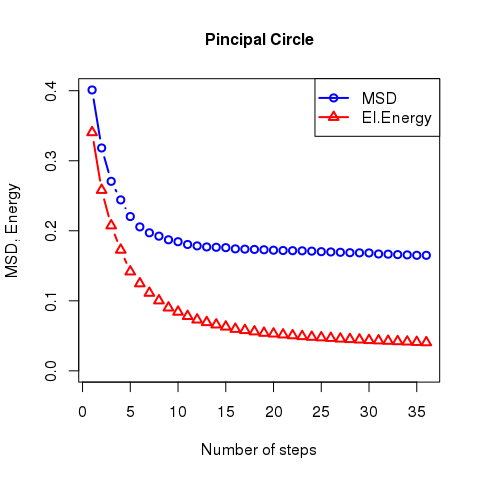
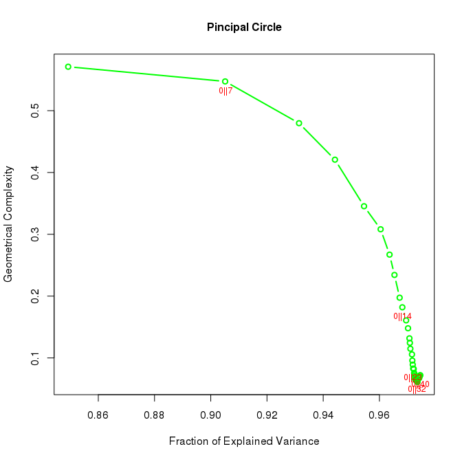
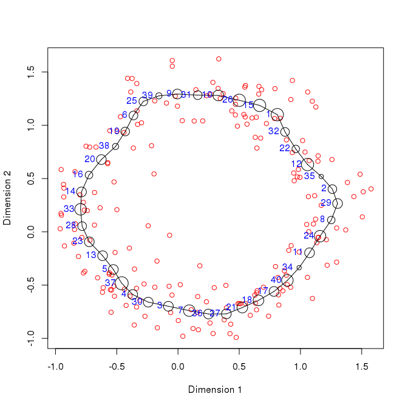
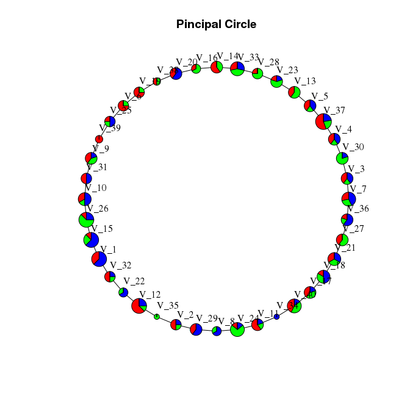

This document describes how to produce a circular principal graph.

Building a principal circle
---------------------------

The `simple_circle` dataset included in the package describe points placed on a three dimensional circle and We can use it to test the usage of principal cicrles

``` r
library(rpgraph)
```

    ## Loading required package: rJava

    ## 
    ## Attaching package: 'rpgraph'

    ## The following object is masked from 'package:base':
    ## 
    ##     Filter

``` r
Data <- simple_circle
Results <- computeElasticPrincipalGraph(Data = Data, NumNodes = 40, Method = 'CircleConfiguration')
```

    ## Configuring engine ......[1] "Empty initialization"
    ## [1] ""
    ## [1] "Running engine"

Now `Results` will be a list and the first element will contain the processed principal graph. Diagnostic information can be obtained using

``` r
plotMSDEnergyPlot(Results[[1]], Main = "Pincipal Circle", Cex.Main = 1)
```



and

``` r
accuracyComplexityPlot(Results[[1]], Main = "Pincipal Circle", Cex.Main = 1, Mode = 5)
```



It it also possible to zoom into a specific area of the accuracy/complexity plot by using the Xlims parameter.

``` r
accuracyComplexityPlot(Results[[1]], Main = "Pincipal Circle", Cex.Main = 1, Xlims = c(.97, .98))
```


Data can be plotted in 2D using the R built-in functions

``` r
plotData2D(Data = simple_circle, PrintGraph = Results[[1]],
           GroupsLab = rep(1, nrow(simple_circle)), Xlab = "Dimension 1", Ylab = "Dimension 2")
```



or plotly, which produces an interactive plot. Using plotly interactivelly requires running the code in RStudio (does it?)

``` r
plotData2D(Data = simple_circle, PrintGraph = Results[[1]], Plot.ly = TRUE,
           GroupsLab = factor(rep(1, nrow(simple_circle))), Xlab = "Dimension 1", Ylab = "Dimension 2")
```

This commands will produce a list of warnings, which can be ignored. Unfortunately there is not an easy way to fix it at this time.

The plotly graph can be exported on the web, for example on [plot.ly](http://plot.ly) using the instruction provided [here](http://plot.ly/r/getting-started/).

Data can also be plotted in 3D using the functionalities provided by the `rgl` package

``` r
plotData3D(Data = simple_circle, PrintGraph = Results[[1]], Plot.ly = FALSE,
           GroupsLab = factor(rep(1, nrow(simple_circle))), NodeSizeMult = 0.05,
           Xlab = "Dimension 1", Ylab = "Dimension 2", Zlab = "Dimension 3")
```

The output of this command is not available on this web page due to the working of `rgl`.

For `rgl` to work correctly on MacOS, a proper X11 environment need to be installed. The most common solution is the installation of [XQuartz](http://www.xquartz.org/). If the code crashes R, try using

``` r
library("rgl")
open3d()
```

before invoking the `plotData3D` function and/or rebooting the system.

It is also possible to produce 3D plots using plot.ly.

``` r
plotData3D(Data = simple_circle, PrintGraph = Results[[1]], Plot.ly = TRUE,
           GroupsLab = factor(rep(1, nrow(simple_circle))),
           Xlab = "Dimension 1", Ylab = "Dimension 2", Zlab = "Dimension 3")
```

Similarly to 2D, it is possible to export the plot to a web resource.

To see how different populations distribute among the nodes of the graph by providing a population identifier to each point in the original data (The `Categories` vector). In the following example, three populations are randomly assigned.

``` r
Net <- ConstructGraph(Results = Results[[1]], DirectionMat = NULL, Thr = 0.05)
TaxonList <- getTaxonMap(Results = Results[[1]], Data = Data)

InfoData <- plotPieNet(Results = Results[[1]], Data = simple_circle, NodeSizeMult = 4,
                       Categories = factor(sample(1:3, nrow(simple_circle), replace = TRUE)),
           Graph = Net, TaxonList = TaxonList, LayOut = 'circle', Main = "Pincipal Circle")
```


