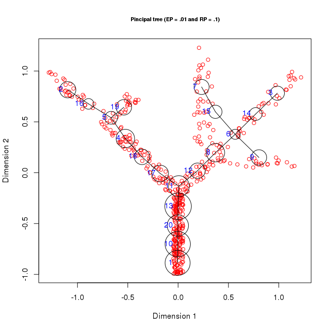
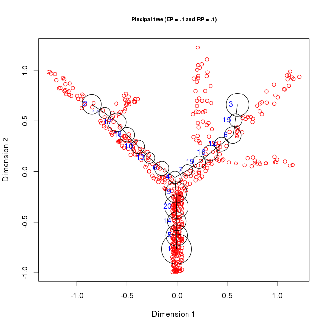
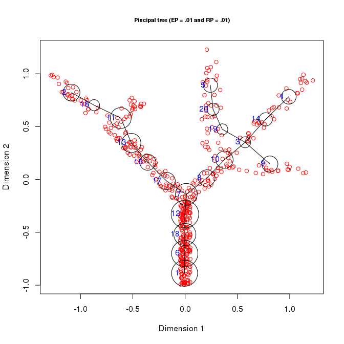

This document describes how to vary the internal parameters used by the java library during the construction of the principal graph.

Building different principal trees
----------------------------------

The construction of principal graphs is controlled by the two parameters **EP**, which indicates the coefficient of elastic stretching of the graph, and **RP**, which indicates the penalty coefficient for the deviation from harmonicity. By default EP is equal to 0.01 and RP to 0.1. However it is possible to change these parameters direclty when building the graph. Changing these values will affect how the princial graph is fitted to the data.

``` r
library(rpgraph)
```

    ## Loading required package: rJava

    ## 
    ## Attaching package: 'rpgraph'

    ## The following object is masked from 'package:base':
    ## 
    ##     Filter

``` r
Results <- computeElasticPrincipalGraph(Data = simple_tree, NumNodes = 20, Method = 'DefaultPrincipalTreeConfiguration')
```

    ## Configuring engine ......[1] "Empty initialization"
    ## [1] ""
    ## [1] "Running engine"

``` r
plotData2D(Data = simple_tree, PrintGraph = Results[[1]] ,
           GroupsLab = rep(1, nrow(simple_tree)),
           Main = "Pincipal tree (EP = .01 and RP = .1)",
           Xlab = "Dimension 1", Ylab = "Dimension 2")
```



``` r
Results <- computeElasticPrincipalGraph(Data = simple_tree, NumNodes = 20, Method = 'DefaultPrincipalTreeConfiguration', EP = .1)
```

    ## [1] "Additional parameters found"
    ## $EP
    ## [1] 0.1
    ## 
    ## [1] "EP set by user"
    ## Configuring engine ......[1] "Empty initialization"
    ## [1] ""
    ## [1] "Running engine"

``` r
plotData2D(Data = simple_tree, PrintGraph = Results[[1]] ,
           GroupsLab = rep(1, nrow(simple_tree)),
           Main = "Pincipal tree (EP = .1 and RP = .1)",
           Xlab = "Dimension 1", Ylab = "Dimension 2")
```



``` r
Results <- computeElasticPrincipalGraph(Data = simple_tree, NumNodes = 20, Method = 'DefaultPrincipalTreeConfiguration', RP = .01)
```

    ## [1] "Additional parameters found"
    ## $RP
    ## [1] 0.01
    ## 
    ## [1] "RP set by user"
    ## Configuring engine ......[1] "Empty initialization"
    ## [1] ""
    ## [1] "Running engine"

``` r
plotData2D(Data = simple_tree, PrintGraph = Results[[1]] ,
           GroupsLab = rep(1, nrow(simple_tree)),
           Main = "Pincipal tree (EP = .01 and RP = .01)",
           Xlab = "Dimension 1", Ylab = "Dimension 2")
```



``` r
Results <- computeElasticPrincipalGraph(Data = simple_tree, NumNodes = 20, Method = 'DefaultPrincipalTreeConfiguration', EP = .2, RP = .01)
```

    ## [1] "Additional parameters found"
    ## $EP
    ## [1] 0.2
    ## 
    ## $RP
    ## [1] 0.01
    ## 
    ## [1] "EP set by user"
    ## [1] "RP set by user"
    ## Configuring engine ......[1] "Empty initialization"
    ## [1] ""
    ## [1] "Running engine"

``` r
plotData2D(Data = simple_tree, PrintGraph = Results[[1]] ,
           GroupsLab = rep(1, nrow(simple_tree)),
           Main = "Pincipal tree (EP = .2 and RP = .01)",
           Xlab = "Dimension 1", Ylab = "Dimension 2")
```


