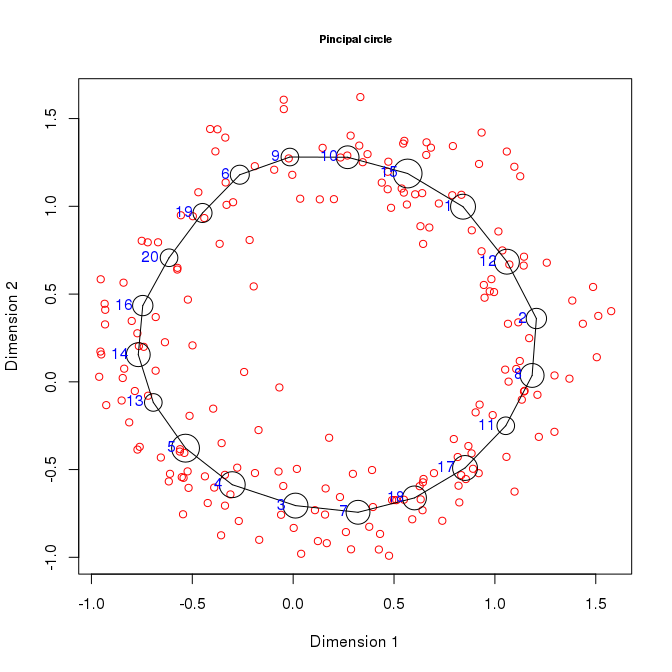
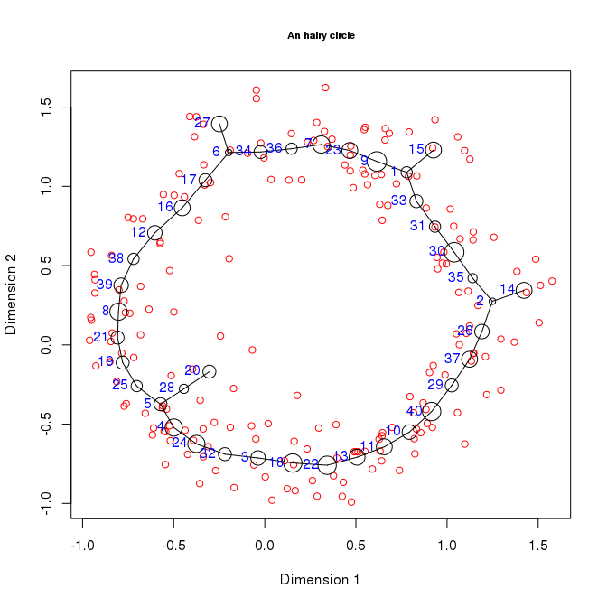
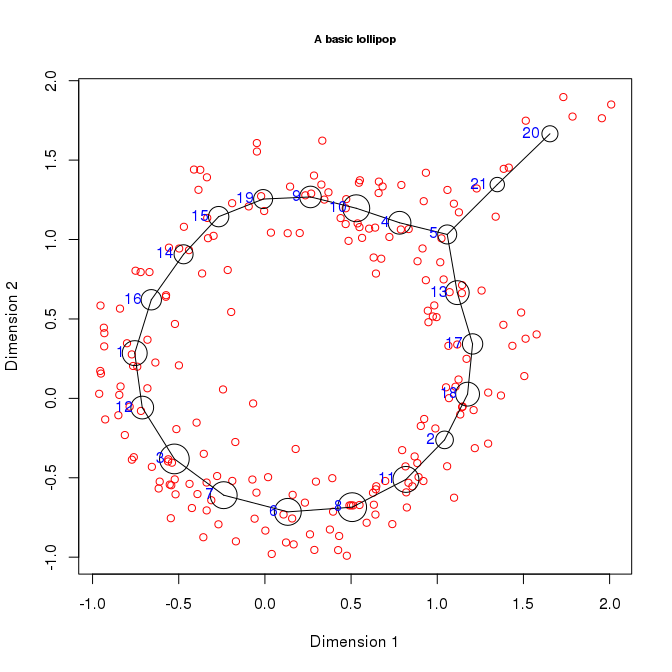
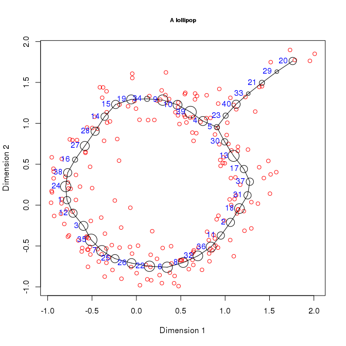
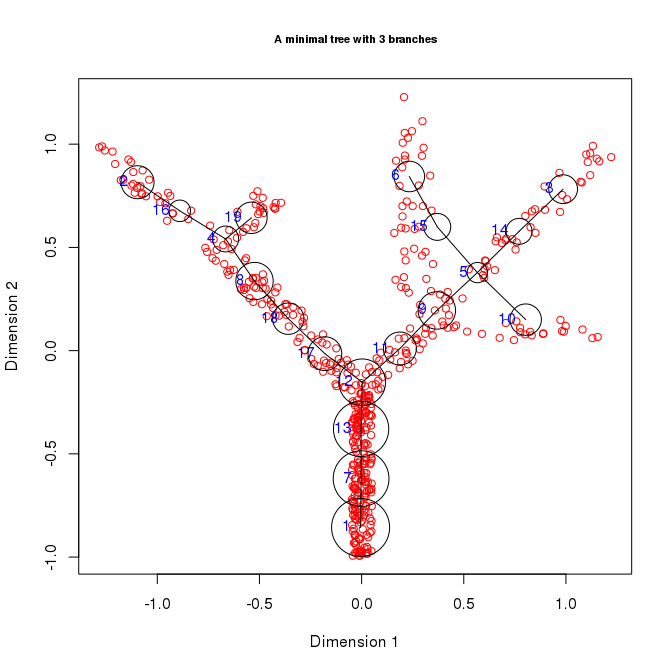
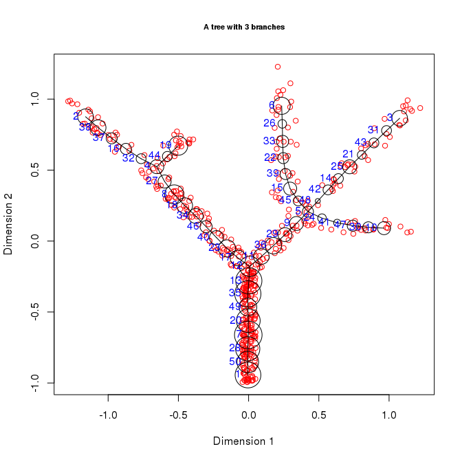

This document describes how to combine different graph grammars to produce advanced topologies

An *hairy circle*
-----------------

The `simple_circle` dataset included in the package describes points placed on a three dimensional circle. To produce an circle with additional brances we stard by producing a circle

``` r
library(rpgraph)
```

    ## Loading required package: rJava

    ## 
    ## Attaching package: 'rpgraph'

    ## The following object is masked from 'package:base':
    ## 
    ##     Filter

``` r
PCircle <- computeElasticPrincipalGraph(Data = simple_circle, NumNodes = 20, Method = 'CircleConfiguration')
```

    ## Configuring engine ......[1] "Empty initialization"
    ## [1] ""
    ## [1] "Running engine"

``` r
plotData2D(Data = simple_circle, PrintGraph = PCircle[[1]] ,
           GroupsLab = rep(1, nrow(simple_tree)),
           Main = "Pincipal circle",
           Xlab = "Dimension 1", Ylab = "Dimension 2")
```



It is then possible to add branches by contructing a tree starting from the circle obtained

``` r
HairyCircle <- computeElasticPrincipalGraph(Data = simple_circle, NumNodes = 40,
                                            Method = 'DefaultPrincipalTreeConfiguration',
                                            NodesPositions = PCircle[[1]]$Nodes, Edges = PCircle[[1]]$Edges)
```

    ## Configuring engine ......[1] "Data-dependent initialization"
    ## [1] ""
    ## [1] "Running engine"

``` r
plotData2D(Data = simple_circle, PrintGraph = HairyCircle[[1]] ,
           GroupsLab = rep(1, nrow(simple_tree)),
           Main = "An hairy circle",
           Xlab = "Dimension 1", Ylab = "Dimension 2")
```



An *lollipop*
-------------

Is it also possible to construct a circle with only one branching point. However, this requires a more advanced approach. We will start by adding a strong branch to the `simple_circle` dataset and by getting the initial principal circle.

``` r
library(rpgraph)

Data <- rbind(simple_circle,
      cbind(seq(1,2,.1) + rnorm(11, sd=0.1),
      seq(1,2,.1) + rnorm(11, sd=0.1),
      rnorm(11, sd=0.1))
)


PCircle <- computeElasticPrincipalGraph(Data = Data, NumNodes = 20, Method = 'CircleConfiguration')
```

    ## Configuring engine ......[1] "Empty initialization"
    ## [1] ""
    ## [1] "Running engine"

we will now apply the tree grammar une step at the time untill we get a single branching points

``` r
NBranches <- 0

tGraph <- PCircle

while(NBranches != 1){
  tGraph <- computeElasticPrincipalGraph(Data = Data, NumNodes = nrow(tGraph[[1]]$Nodes) + 1,
                                         Method = 'DefaultPrincipalTreeConfiguration',
                                         NodesPositions = tGraph[[1]]$Nodes, Edges = tGraph[[1]]$Edges)
  
  Br <- strsplit(as.character(tGraph[[1]]$Report$BARCODE), "||", fixed = TRUE)[[1]][1]
  NBranches <- sum(as.integer(strsplit(Br, "|", fixed = TRUE)[[1]]))
}
```

    ## Configuring engine ......[1] "Data-dependent initialization"
    ## [1] ""
    ## [1] "Running engine"

We now has a circle with a single branching point.

``` r
plotData2D(Data = Data, PrintGraph = tGraph[[1]] ,
           GroupsLab = rep(1, nrow(simple_circle)),
           Main = "A basic lollipop",
           Xlab = "Dimension 1", Ylab = "Dimension 2")
```



To avoid adding new branching points, we need to use the principal curve grammar from now on

``` r
Lollipop <- computeElasticPrincipalGraph(Data = Data, NumNodes = 40,
                                         Method = 'CurveConfiguration',
                                         NodesPositions = tGraph[[1]]$Nodes, Edges = tGraph[[1]]$Edges)
```

    ## Configuring engine ......[1] "Data-dependent initialization"
    ## [1] ""
    ## [1] "Running engine"

``` r
plotData2D(Data = Data, PrintGraph = Lollipop[[1]] ,
           GroupsLab = rep(1, nrow(simple_circle)),
           Main = "A lollipop",
           Xlab = "Dimension 1", Ylab = "Dimension 2")
```



An tree with a maximum number of branches
-----------------------------------------

Using an approch similar to whas has been done before, it is possible to create a principal tre with a fixed number of branches. Assumme for example that we wat to fit a principal tree to the `simple_tree` dataset with only 3 branches. To do that we start by constructing a tree with only three brances

``` r
tGraph <- computeElasticPrincipalGraph(Data = simple_tree, NumNodes = 3,
                                       Method = 'DefaultPrincipalTreeConfiguration')
```

    ## Configuring engine ......[1] "Empty initialization"
    ## [1] ""
    ## [1] "Running engine"

``` r
NBranches <- unlist(strsplit(as.character(tGraph[[1]]$Report$BARCODE), "||", fixed = TRUE))[1]

while(NBranches < 3){
  tGraph <- computeElasticPrincipalGraph(Data = simple_tree, NumNodes = nrow(tGraph[[1]]$Nodes) + 1,
                                         Method = 'DefaultPrincipalTreeConfiguration',
                                         NodesPositions = tGraph[[1]]$Nodes, Edges = tGraph[[1]]$Edges)
  
  Br <- strsplit(as.character(tGraph[[1]]$Report$BARCODE), "||", fixed = TRUE)[[1]][1]
  NBranches <- sum(as.integer(strsplit(Br, "|", fixed = TRUE)[[1]]))
}
```

    ## Configuring engine ......[1] "Data-dependent initialization"
    ## [1] ""
    ## [1] "Running engine"
    ## Configuring engine ......[1] "Data-dependent initialization"
    ## [1] ""
    ## [1] "Running engine"
    ## Configuring engine ......[1] "Data-dependent initialization"
    ## [1] ""
    ## [1] "Running engine"
    ## Configuring engine ......[1] "Data-dependent initialization"
    ## [1] ""
    ## [1] "Running engine"
    ## Configuring engine ......[1] "Data-dependent initialization"
    ## [1] ""
    ## [1] "Running engine"
    ## Configuring engine ......[1] "Data-dependent initialization"
    ## [1] ""
    ## [1] "Running engine"
    ## Configuring engine ......[1] "Data-dependent initialization"
    ## [1] ""
    ## [1] "Running engine"
    ## Configuring engine ......[1] "Data-dependent initialization"
    ## [1] ""
    ## [1] "Running engine"
    ## Configuring engine ......[1] "Data-dependent initialization"
    ## [1] ""
    ## [1] "Running engine"
    ## Configuring engine ......[1] "Data-dependent initialization"
    ## [1] ""
    ## [1] "Running engine"
    ## Configuring engine ......[1] "Data-dependent initialization"
    ## [1] ""
    ## [1] "Running engine"
    ## Configuring engine ......[1] "Data-dependent initialization"
    ## [1] ""
    ## [1] "Running engine"
    ## Configuring engine ......[1] "Data-dependent initialization"
    ## [1] ""
    ## [1] "Running engine"
    ## Configuring engine ......[1] "Data-dependent initialization"
    ## [1] ""
    ## [1] "Running engine"
    ## Configuring engine ......[1] "Data-dependent initialization"
    ## [1] ""
    ## [1] "Running engine"
    ## Configuring engine ......[1] "Data-dependent initialization"
    ## [1] ""
    ## [1] "Running engine"

``` r
plotData2D(Data = simple_tree, PrintGraph = tGraph[[1]] ,
           GroupsLab = rep(1, nrow(simple_tree)),
           Main = "A minimal tree with 3 branches",
           Xlab = "Dimension 1", Ylab = "Dimension 2")
```



Now the tree can be extended by using the curve topology

``` r
tGraph <- computeElasticPrincipalGraph(Data = simple_tree, NumNodes = 50,
                                         Method = 'CurveConfiguration',
                                         NodesPositions = tGraph[[1]]$Nodes, Edges = tGraph[[1]]$Edges)
```

    ## Configuring engine ......[1] "Data-dependent initialization"
    ## [1] ""
    ## [1] "Running engine"

``` r
plotData2D(Data = simple_tree, PrintGraph = tGraph[[1]] ,
           GroupsLab = rep(1, nrow(simple_tree)),
           Main = "A tree with 3 branches",
           Xlab = "Dimension 1", Ylab = "Dimension 2")
```


