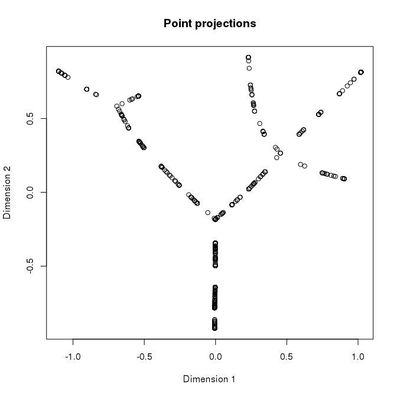

This document describes how to peoject points on a previously constructed principal graph.

Building a tree
---------------

This example will show how to project points on a principal tree. However, the procedure is completely generic and can be used with any principal graph.

``` r
library(rpgraph)
```

    ## Loading required package: rJava

    ## 
    ## Attaching package: 'rpgraph'

    ## The following object is masked from 'package:base':
    ## 
    ##     Filter

``` r
Data <- simple_tree
Results <- computeElasticPrincipalGraph(Data = Data, NumNodes = 30, Method = 'DefaultPrincipalTreeConfiguration')
```

    ## Configuring engine ......[1] "Empty initialization"
    ## [1] ""
    ## [1] "Running engine"

By plotting the data in 2D we can see that different paths are present in the treee.

``` r
plotData2D(Data = simple_tree, PrintGraph = Results[[1]] ,
           GroupsLab = rep(1, nrow(simple_circle)), Col = "black",
           Main = "Pincipal tree",
           Xlab = "Dimension 1", Ylab = "Dimension 2")
```


Making a network
----------------

To get the different paths we can use graph analysis approach supported by the `igraph` library. Firts of all, we need to construct a network from the princial graph.

``` r
library(igraph)
```

    ## 
    ## Attaching package: 'igraph'

    ## The following objects are masked from 'package:stats':
    ## 
    ##     decompose, spectrum

    ## The following object is masked from 'package:base':
    ## 
    ##     union

``` r
Net <- ConstructGraph(Results = Results[[1]], DirectionMat = NULL)
```

We can now obtain the end points by looking at nodes with degree 1 and find the shorthest path between them.

``` r
EndPoints <- V(Net)[degree(Net) == 1]
AllPaths <- list()
for(StartIdx in 1:length(EndPoints)){
  Paths <- get.shortest.paths(graph = Net, from = EndPoints[StartIdx], to = EndPoints[-StartIdx])
  AllPaths <- append(AllPaths, Paths$vpath)
}
```

The paths found can be listed by looking at `AllPaths`.

``` r
AllPaths
```

    ## [[1]]
    ## + 14/30 vertices, named:
    ##  [1] V_1  V_25 V_8  V_16 V_10 V_9  V_13 V_19 V_14 V_4  V_27 V_24 V_12 V_2 
    ## 
    ## [[2]]
    ## + 14/30 vertices, named:
    ##  [1] V_1  V_25 V_8  V_16 V_10 V_9  V_21 V_29 V_22 V_5  V_26 V_28 V_17 V_6 
    ## 
    ## [[3]]
    ## + 13/30 vertices, named:
    ##  [1] V_1  V_25 V_8  V_16 V_10 V_9  V_13 V_19 V_14 V_4  V_27 V_24 V_15
    ## 
    ## [[4]]
    ## + 13/30 vertices, named:
    ##  [1] V_1  V_25 V_8  V_16 V_10 V_9  V_21 V_29 V_22 V_5  V_20 V_30 V_7 
    ## 
    ## [[5]]
    ## + 14/30 vertices, named:
    ##  [1] V_1  V_25 V_8  V_16 V_10 V_9  V_21 V_29 V_22 V_5  V_11 V_23 V_18 V_3 
    ## 
    ## [[6]]
    ## + 14/30 vertices, named:
    ##  [1] V_2  V_12 V_24 V_27 V_4  V_14 V_19 V_13 V_9  V_10 V_16 V_8  V_25 V_1 
    ## 
    ## [[7]]
    ## + 17/30 vertices, named:
    ##  [1] V_2  V_12 V_24 V_27 V_4  V_14 V_19 V_13 V_9  V_21 V_29 V_22 V_5  V_26
    ## [15] V_28 V_17 V_6 
    ## 
    ## [[8]]
    ## + 4/30 vertices, named:
    ## [1] V_2  V_12 V_24 V_15
    ## 
    ## [[9]]
    ## + 16/30 vertices, named:
    ##  [1] V_2  V_12 V_24 V_27 V_4  V_14 V_19 V_13 V_9  V_21 V_29 V_22 V_5  V_20
    ## [15] V_30 V_7 
    ## 
    ## [[10]]
    ## + 17/30 vertices, named:
    ##  [1] V_2  V_12 V_24 V_27 V_4  V_14 V_19 V_13 V_9  V_21 V_29 V_22 V_5  V_11
    ## [15] V_23 V_18 V_3 
    ## 
    ## [[11]]
    ## + 14/30 vertices, named:
    ##  [1] V_6  V_17 V_28 V_26 V_5  V_22 V_29 V_21 V_9  V_10 V_16 V_8  V_25 V_1 
    ## 
    ## [[12]]
    ## + 17/30 vertices, named:
    ##  [1] V_6  V_17 V_28 V_26 V_5  V_22 V_29 V_21 V_9  V_13 V_19 V_14 V_4  V_27
    ## [15] V_24 V_12 V_2 
    ## 
    ## [[13]]
    ## + 16/30 vertices, named:
    ##  [1] V_6  V_17 V_28 V_26 V_5  V_22 V_29 V_21 V_9  V_13 V_19 V_14 V_4  V_27
    ## [15] V_24 V_15
    ## 
    ## [[14]]
    ## + 8/30 vertices, named:
    ## [1] V_6  V_17 V_28 V_26 V_5  V_20 V_30 V_7 
    ## 
    ## [[15]]
    ## + 9/30 vertices, named:
    ## [1] V_6  V_17 V_28 V_26 V_5  V_11 V_23 V_18 V_3 
    ## 
    ## [[16]]
    ## + 13/30 vertices, named:
    ##  [1] V_15 V_24 V_27 V_4  V_14 V_19 V_13 V_9  V_10 V_16 V_8  V_25 V_1 
    ## 
    ## [[17]]
    ## + 4/30 vertices, named:
    ## [1] V_15 V_24 V_12 V_2 
    ## 
    ## [[18]]
    ## + 16/30 vertices, named:
    ##  [1] V_15 V_24 V_27 V_4  V_14 V_19 V_13 V_9  V_21 V_29 V_22 V_5  V_26 V_28
    ## [15] V_17 V_6 
    ## 
    ## [[19]]
    ## + 15/30 vertices, named:
    ##  [1] V_15 V_24 V_27 V_4  V_14 V_19 V_13 V_9  V_21 V_29 V_22 V_5  V_20 V_30
    ## [15] V_7 
    ## 
    ## [[20]]
    ## + 16/30 vertices, named:
    ##  [1] V_15 V_24 V_27 V_4  V_14 V_19 V_13 V_9  V_21 V_29 V_22 V_5  V_11 V_23
    ## [15] V_18 V_3 
    ## 
    ## [[21]]
    ## + 13/30 vertices, named:
    ##  [1] V_7  V_30 V_20 V_5  V_22 V_29 V_21 V_9  V_10 V_16 V_8  V_25 V_1 
    ## 
    ## [[22]]
    ## + 16/30 vertices, named:
    ##  [1] V_7  V_30 V_20 V_5  V_22 V_29 V_21 V_9  V_13 V_19 V_14 V_4  V_27 V_24
    ## [15] V_12 V_2 
    ## 
    ## [[23]]
    ## + 8/30 vertices, named:
    ## [1] V_7  V_30 V_20 V_5  V_26 V_28 V_17 V_6 
    ## 
    ## [[24]]
    ## + 15/30 vertices, named:
    ##  [1] V_7  V_30 V_20 V_5  V_22 V_29 V_21 V_9  V_13 V_19 V_14 V_4  V_27 V_24
    ## [15] V_15
    ## 
    ## [[25]]
    ## + 8/30 vertices, named:
    ## [1] V_7  V_30 V_20 V_5  V_11 V_23 V_18 V_3 
    ## 
    ## [[26]]
    ## + 14/30 vertices, named:
    ##  [1] V_3  V_18 V_23 V_11 V_5  V_22 V_29 V_21 V_9  V_10 V_16 V_8  V_25 V_1 
    ## 
    ## [[27]]
    ## + 17/30 vertices, named:
    ##  [1] V_3  V_18 V_23 V_11 V_5  V_22 V_29 V_21 V_9  V_13 V_19 V_14 V_4  V_27
    ## [15] V_24 V_12 V_2 
    ## 
    ## [[28]]
    ## + 9/30 vertices, named:
    ## [1] V_3  V_18 V_23 V_11 V_5  V_26 V_28 V_17 V_6 
    ## 
    ## [[29]]
    ## + 16/30 vertices, named:
    ##  [1] V_3  V_18 V_23 V_11 V_5  V_22 V_29 V_21 V_9  V_13 V_19 V_14 V_4  V_27
    ## [15] V_24 V_15
    ## 
    ## [[30]]
    ## + 8/30 vertices, named:
    ## [1] V_3  V_18 V_23 V_11 V_5  V_20 V_30 V_7

We can also look at their lengh distribution

``` r
table(sapply(AllPaths, length))
```

    ## 
    ##  4  8  9 13 14 15 16 17 
    ##  2  4  2  4  6  2  6  4

``` r
barplot(table(sapply(AllPaths, length)), main = "Paths between the endpoints", xlab = "length", ylab = "Frequency")
```


For this example, we will select one of the longest paths.

``` r
SelPathIdx <- sample(which(sapply(AllPaths, length) == max(sapply(AllPaths, length))), 1)
SelPath <- AllPaths[[SelPathIdx]]
SelPath
```

    ## + 17/30 vertices, named:
    ##  [1] V_2  V_12 V_24 V_27 V_4  V_14 V_19 V_13 V_9  V_21 V_29 V_22 V_5  V_26
    ## [15] V_28 V_17 V_6

Projecting all the points
-------------------------

We can now project the points on the path

``` r
TaxonList <- getTaxonMap(Results = Results[[1]], Data = Data)
Projections <- projectPoints(Results = Results[[1]], Data = Data, TaxonList = TaxonList, UseR = TRUE)
```

`Projections` will now contains the projections of the points on the graph in the `PointsOnEdgesCoords` field. We can use this information to confirm that the points are correctly projected on the tree.

``` r
plot(Projections$PointsOnEdgesCoords[,1:2], xlab = "Dimension 1", ylab = "Dimension 2", main = "Point projections")
```



It is now possible to project the points on the selected path. Note that in the `igraph` representation of the principal graph the nodes have a "V\_" prefix to their names that need to be removed when going back to the original point names which are defined by their names.

``` r
NumericPath <- as.numeric(unlist(lapply(strsplit(SelPath$name, "V_"), "[[", 2)))
```

It is now possible to order the points on the selected path. Note that points associated with edges not present in the path will not considered.

``` r
PathProjection <- OrderOnPath(PrinGraph = Results[[1]], Path = NumericPath, PointProjections = Projections)
```

    ## [1] "20 points found on edge"
    ## [1] "10 points found on edge"
    ## [1] "18 points found on edge"
    ## [1] "22 points found on edge"
    ## [1] "0 points found on edge"
    ## [1] "26 points found on edge"
    ## [1] "19 points found on edge"
    ## [1] "2 points found on edge"
    ## [1] "30 points found on edge"
    ## [1] "12 points found on edge"
    ## [1] "27 points found on edge"
    ## [1] "1 points found on edge"
    ## [1] "5 points found on edge"
    ## [1] "9 points found on edge"
    ## [1] "17 points found on edge"
    ## [1] "13 points found on edge"

The ordered points can now be plotted and color-coded according to their position (i.e. `PathProjection$PositionOnPath`).

``` r
plot(Projections$PointsOnEdgesCoords[order(PathProjection$PositionOnPath, na.last = NA),1:2], xlab = "Dimension 1", ylab = "Dimension 2", main = "Point projections", col=heat.colors(sum(!is.na(PathProjection$PositionOnPath))))
```


