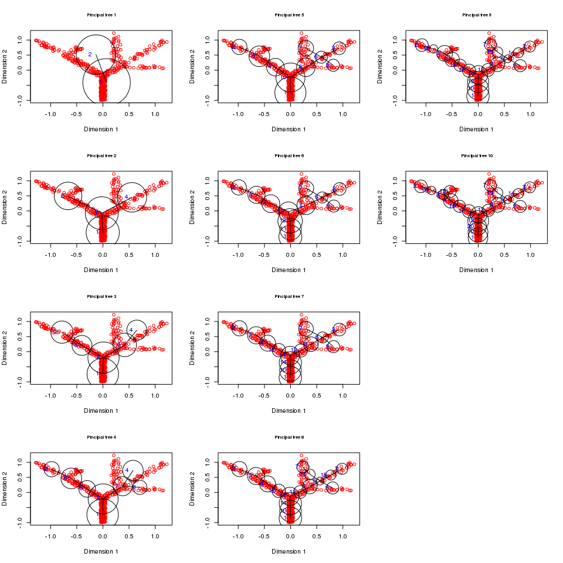
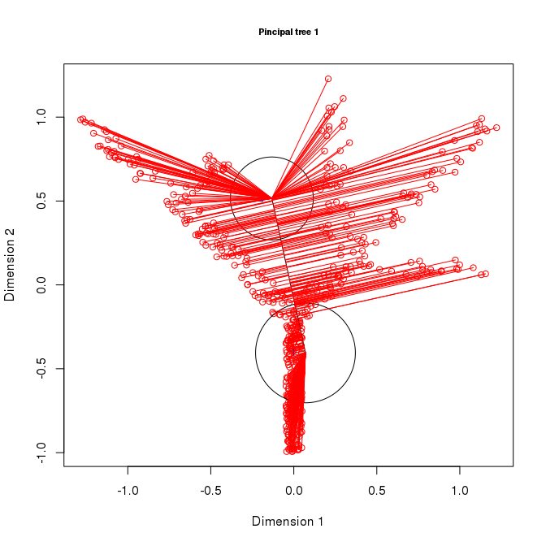
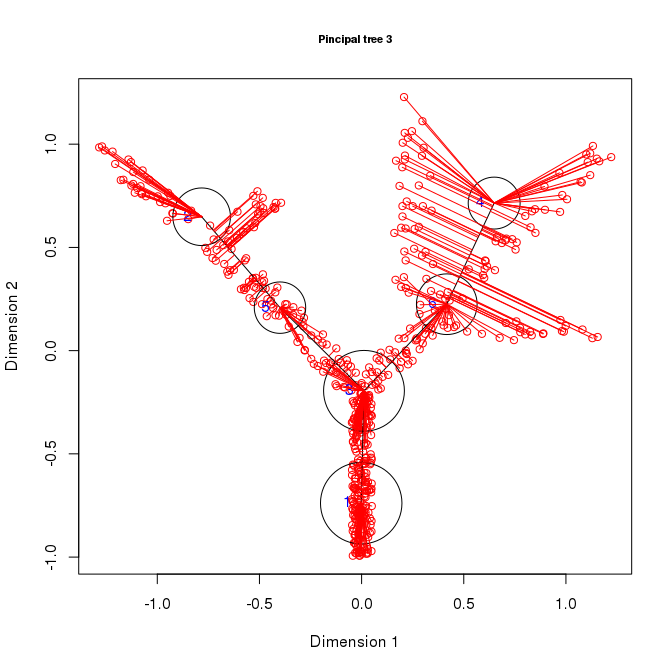
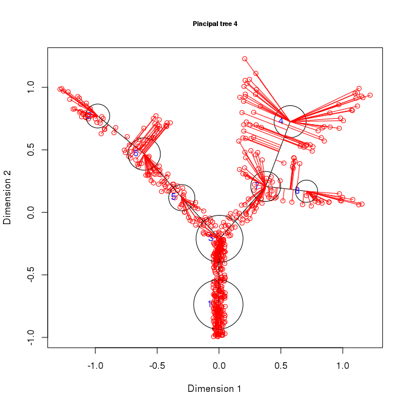
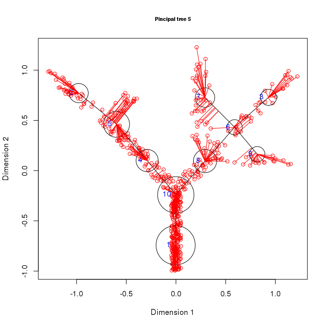
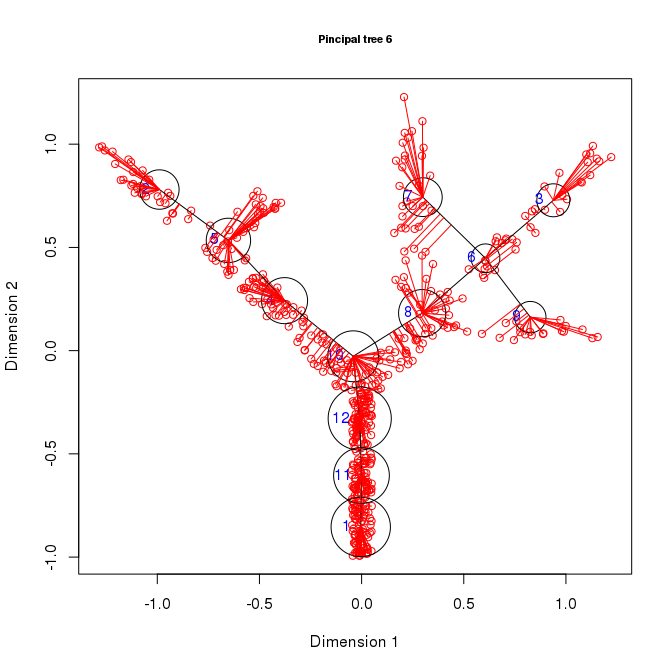
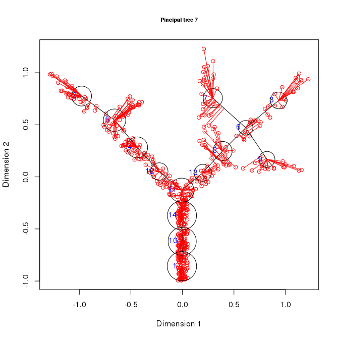
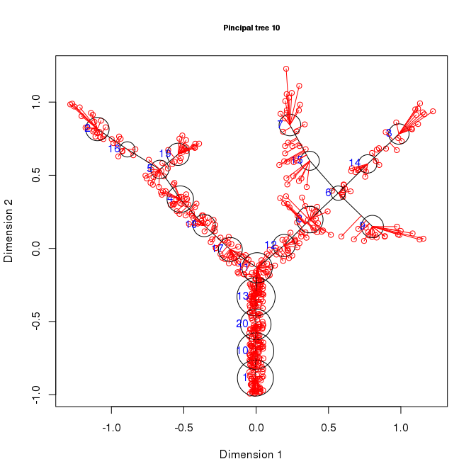

This document describes how to produce a sequence of principal trees to that can be used to observe the dynamics of the algorithm and to produce animations.

Building a principal tree
-------------------------

The `simple tree` dataset included in the package describes points placed on a three dimensional tree and we can use it to test the usage of principal trees. The `computeElasticPrincipalGraph` include an optional argument `NodeStep` that ca be used to obtain the intermediate steps. For example setting `NodeStep = 2` will save all the intermediate principal trees after 2 nodes have been added, i.e. will output tress with 2, 4, 6, 8, ... nodes.

``` r
library(rpgraph)
```

    ## Loading required package: rJava

    ## 
    ## Attaching package: 'rpgraph'

    ## The following object is masked from 'package:base':
    ## 
    ##     Filter

``` r
Results <- computeElasticPrincipalGraph(Data = simple_tree, NumNodes = 20, Method = 'DefaultPrincipalTreeConfiguration', NodeStep = 2)
```

    ## Configuring engine ......[1] "Empty initialization"
    ## [1] ""
    ## [1] "Running engine"
    ## Configuring engine ......[1] "Data-dependent initialization"
    ## [1] ""
    ## [1] "Running engine"
    ## Configuring engine ......[1] "Data-dependent initialization"
    ## [1] ""
    ## [1] "Running engine"
    ## Configuring engine ......[1] "Data-dependent initialization"
    ## [1] ""
    ## [1] "Running engine"
    ## Configuring engine ......[1] "Data-dependent initialization"
    ## [1] ""
    ## [1] "Running engine"
    ## Configuring engine ......[1] "Data-dependent initialization"
    ## [1] ""
    ## [1] "Running engine"
    ## Configuring engine ......[1] "Data-dependent initialization"
    ## [1] ""
    ## [1] "Running engine"
    ## Configuring engine ......[1] "Data-dependent initialization"
    ## [1] ""
    ## [1] "Running engine"
    ## Configuring engine ......[1] "Data-dependent initialization"
    ## [1] ""
    ## [1] "Running engine"
    ## Configuring engine ......[1] "Data-dependent initialization"
    ## [1] ""
    ## [1] "Running engine"

Each tree is saved as a different element of the `Results` list. `Results[[1]]` contains the tree with 2 nodes, `Results[[2]]` the tree with 4 nodes and so on. Therefore `Results` can be used to observe different snapshot of the construction process:

``` r
par(mfcol = c(4,3))

for(i in 1:length(Results)){
  plotData2D(Data = simple_tree, PrintGraph = Results[[i]] ,
           GroupsLab = rep(1, nrow(simple_tree)),
           Main = paste("Pincipal tree", i),
           Xlab = "Dimension 1", Ylab = "Dimension 2")
}
```



or to produce a series of plot that can be used for an animation:

``` r
for(i in 1:length(Results)){
  plotData2D(Data = simple_tree, PrintGraph = Results[[i]] ,
           GroupsLab = rep(1, nrow(simple_tree)),
           PlotProjections = "onEdges",
           Main = paste("Pincipal tree", i),
           Xlab = "Dimension 1", Ylab = "Dimension 2")
  Sys.sleep(1)
}
```



    ## [1] "Edge Projections will be computed. Consider do that separetedly"
    ## [1] "TaxonList will be computed. Consider doing that separetedly"


    ## [1] "Edge Projections will be computed. Consider do that separetedly"
    ## [1] "TaxonList will be computed. Consider doing that separetedly"



    ## [1] "Edge Projections will be computed. Consider do that separetedly"
    ## [1] "TaxonList will be computed. Consider doing that separetedly"



    ## [1] "Edge Projections will be computed. Consider do that separetedly"
    ## [1] "TaxonList will be computed. Consider doing that separetedly"



    ## [1] "Edge Projections will be computed. Consider do that separetedly"
    ## [1] "TaxonList will be computed. Consider doing that separetedly"



    ## [1] "Edge Projections will be computed. Consider do that separetedly"
    ## [1] "TaxonList will be computed. Consider doing that separetedly"



    ## [1] "Edge Projections will be computed. Consider do that separetedly"
    ## [1] "TaxonList will be computed. Consider doing that separetedly"


    ## [1] "Edge Projections will be computed. Consider do that separetedly"
    ## [1] "TaxonList will be computed. Consider doing that separetedly"


    ## [1] "Edge Projections will be computed. Consider do that separetedly"
    ## [1] "TaxonList will be computed. Consider doing that separetedly"



    ## [1] "Edge Projections will be computed. Consider do that separetedly"
    ## [1] "TaxonList will be computed. Consider doing that separetedly"
